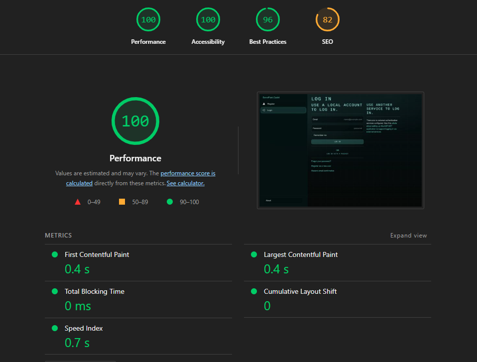
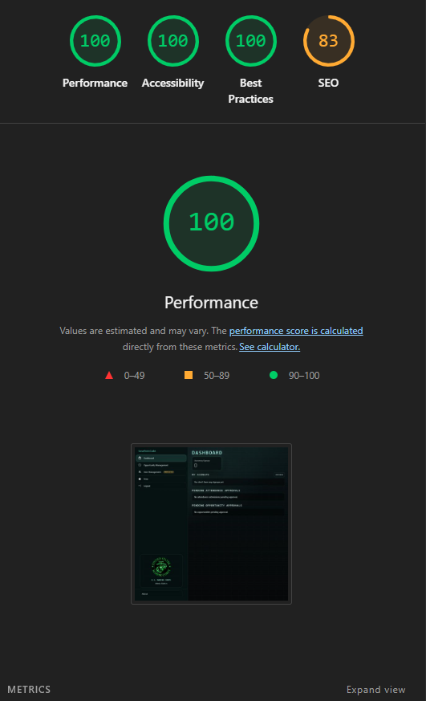
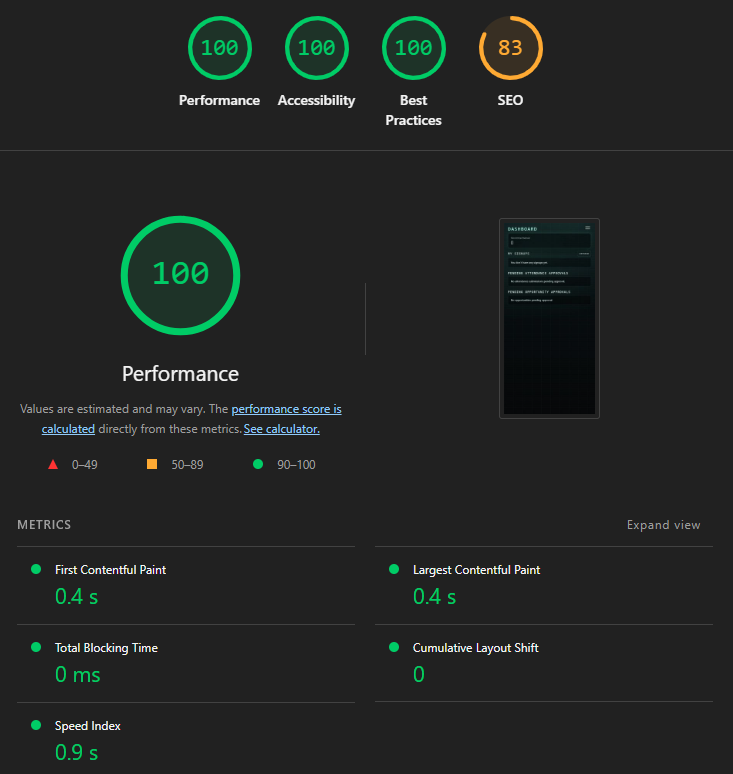
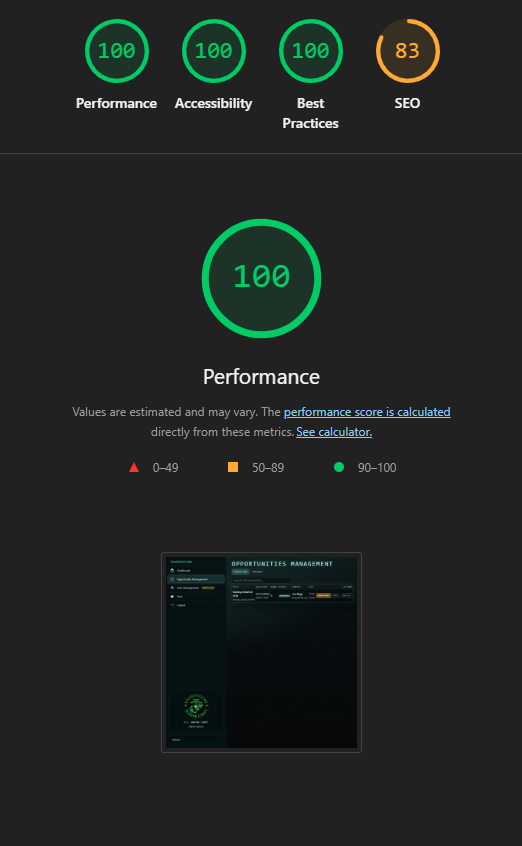
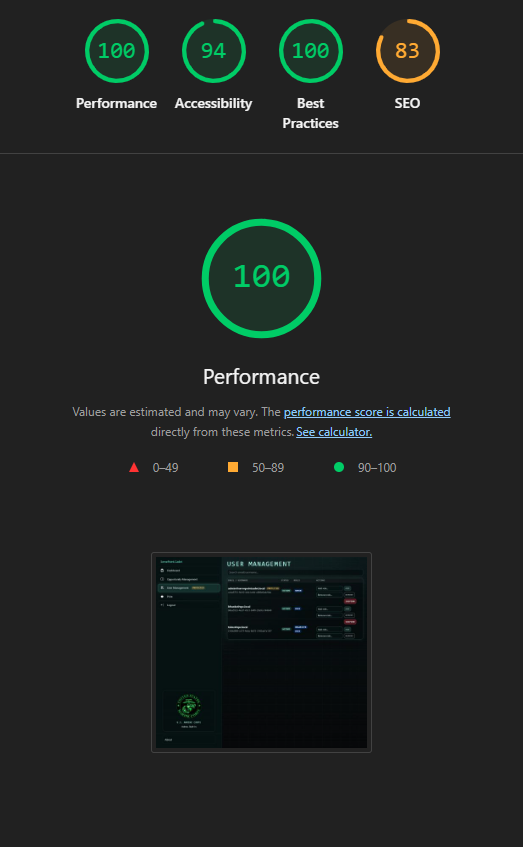
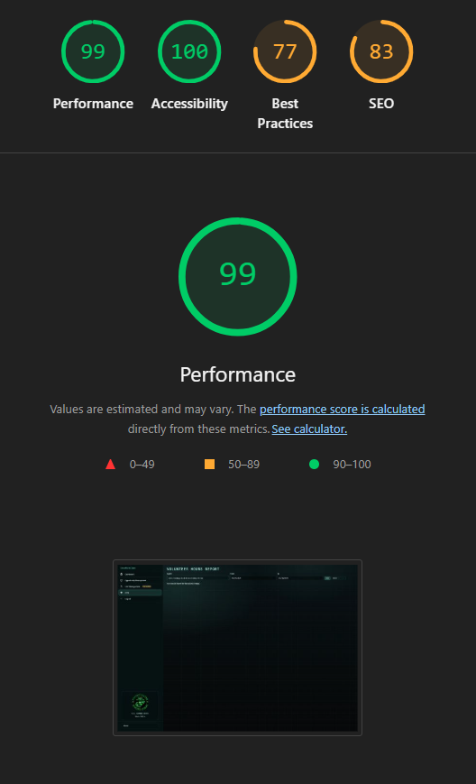
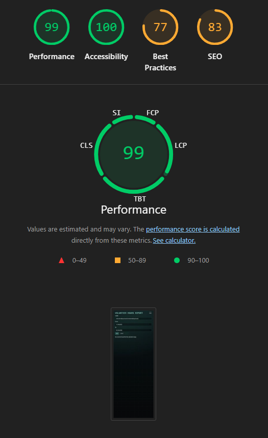

# ServePoint – Volunteer Hours Management System

## Overview

ServePoint is a .NET Blazor web application designed to manage volunteer opportunities and track required service hours through a structured, role-based workflow.

The system replaces manual tracking with a centralized digital solution that ensures accountability, approval oversight, and real-time progress visibility.

This project was designed, developed, tested, and deployed in accordance with the course requirements for a full-stack .NET Blazor application.

---

## Project Objectives

This application demonstrates:

- Practical application of the .NET development ecosystem
- Role-based authentication and authorization
- Full CRUD functionality
- Workflow-based approval logic
- Performance and accessibility validation
- Cloud deployment
- Collaborative project management using Trello and GitHub

---

## Technology Stack

- .NET 9
- Blazor
- ASP.NET Core Identity
- Entity Framework Core
- SQLite (Development)
- PostgreSQL (Production)
- Render.com (Cloud Hosting)

---

## Target Audience

ServePoint is designed for:

- Students required to complete volunteer service hours
- Organizers who create and manage volunteer opportunities
- Instructors who approve attendance submissions
- Administrators who manage roles and system permissions

---

## Authentication & Authorization

Authentication is implemented using ASP.NET Core Identity.

Role-based authorization includes:

- User
- Organizer
- Instructor
- Admin

UI rendering and business logic are enforced through role policies to ensure secure access control.

---

## Core Application Features

### Volunteer Opportunity Management (CRUD)

- Create volunteer opportunities
- Edit opportunities (approval required)
- Delete opportunities (approval required)
- Fixed hour values enforced

### Attendance Workflow

- Users sign up for opportunities
- Users submit attendance
- Instructor/Admin approval required
- Approved hours automatically applied to dashboard totals

### Dashboard

- Displays approved hour totals
- Tracks progress toward required hours (configured in appsettings.json)
- Displays recent activity

### User Management (Admin)

- Assign/remove roles
- System-level oversight
- Built-in admin protection

### Reporting

- Printable volunteer hours report
- Mobile-responsive report formatting

---

## Application Standards Compliance

### Performance

ServePoint was evaluated using Google Lighthouse on the production deployment to ensure realistic network and rendering conditions.

### Lighthouse Results

| Page | Performance | Accessibility | Best Practices | SEO |
|------|------------|--------------|----------------|-----|
| Dashboard | 100 | 100 | 100 | 83 |
| Opportunities | 100 | 100 | 100 | 83 |
| User Management | 100 | 100 | 100 | 83 |
| Reporting | 99 | 100 | 77–96 | 83 |
| Login | 100 | 100 | 96 | 82 |

- Total Blocking Time: 0ms  
- Cumulative Layout Shift: 0  
- Optimized data access via Entity Framework Core  
- Minimal unnecessary network requests

### Accessibility (WCAG 2.1 Level AA Alignment)

Accessibility considerations include:

- Semantic HTML structure
- High contrast UI elements
- Keyboard navigability
- Responsive layout
- Lighthouse accessibility scores: 94–100

### Usability

- Responsive design for desktop and mobile
- Clear navigation hierarchy
- Role-based navigation visibility
- Consistent branding and layout

### Validation

- Lighthouse Best Practices validation
- CSS validation via Chrome DevTools
- Manual functional testing across all roles

## Screenshots

Images are located in the `/docs` directory of the repository.

### Login

### Dashboard

### Mobile Dashboard

### Opportunity Management

### User Management

### Volunteer Report (Desktop)

### Volunteer Report (Mobile)

- 
---

## Navigation Structure

- Home (/)
- Dashboard (/dashboard)
- Opportunities
- Approvals
- Reports
- User Management (Admin)
- Authentication pages

Navigation dynamically adjusts based on assigned role.

---

## Deployment

The application is deployed to a cloud environment with HTTPS enforced.

Deployed Application:
<INSERT DEPLOYED URL HERE>

---

## Project Management

Development was managed using Trello with iterative task tracking:

Backlog → In Progress → Testing → Complete

Trello Board:
https://trello.com/b/8F43orMC/servepoint

---

## Source Code Repository

GitHub Repository:
https://github.com/MBarker2BYU/ServerPoint

---

## Demonstration Video

Group Demonstration Video (~5–7 minutes):

[Software Demo Video](http://youtube.link.goes.here)

The video demonstrates:

- Authentication
- Role-based authorization
- CRUD operations
- Approval workflow
- Dashboard tracking
- Mobile responsiveness
- Production deployment

---

## Screenshots

(Add images in a /docs folder within the repository)

- Login
- Dashboard
- Mobile Dashboard
- Opportunity Management
- User Management
- Volunteer Report (Desktop)
- Volunteer Report (Mobile)

---

## License

Academic Use Only – Commercial Rights Reserved

This software (ServePoint) is provided for academic purposes as part of the BYU-Idaho / Pathway .NET Web Applications course.

Copyright © 2026 Matthew Barker and ShadowWox Systems LLC.

All rights, including source code, design, branding, and future commercial exploitation, are retained by ShadowWorx Systems LLC.

No license is granted for any use beyond the scope of the current academic assignment without written permission.

THE SOFTWARE IS PROVIDED "AS IS", WITHOUT WARRANTY OF ANY KIND.
